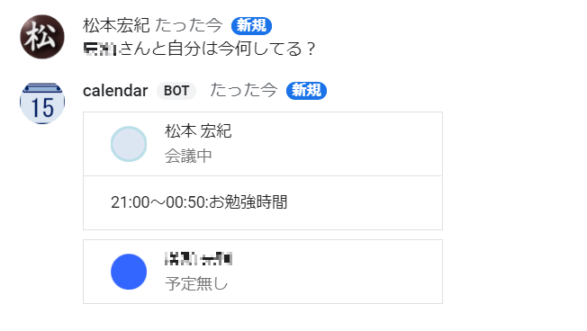

# hangout-calendar-bot

これは、hangout botです。メッセージから対象となる人、そして時間のカレンダーのイベント登録状況を確認します。

内線の取次とかもっと楽に・・・というかそもそももっと簡単に空いての予定確認してから電話してもらえないかな？と思い、作ってみました。

下記のような構成で動きます。

[Dialogflow](https://dialogflow.com/)を利用して下記を実現します。

 - 名寄せ
 - 形態素解析

Google Calendar APIを利用してカレンダー情報を取得します。

# 実際の動き

## 今の予定を確認する。
現在のスケジュール状況を確認します。
アイコンで空いてるかどうか確認できます。

## 人の予定を確認する。
日単位に、予定を確認します。人は複数指定できます。

## チーム単位に予定を確認する。
チーム名を指定して、予定を確認します。

# 仕組み

これはclaspを利用しています。拡張子がjsとなっていますが、Google Apps Scriptにpushした際、自動的にgsに変わります。
ここでは、便宜上gsで統一して記載しています。

## Google Apps Script概要 

### main.gs
メイン処理です。

1. メッセージをまずは受信します。 ([main.js#L6](./main.js#L6))
2. Dialogflowを呼び出して、`人`、`グループ`、`時間` の情報を受け取ります。 ([main.js#L14-L15](./main.js#L14-L15)) Dialogflowでは、下記のように、`PERSON`、`GROUP`、`TIME` と解析をしています。(余計なものもありますが、拡張用に用意しています) 
3. 解析結果の `人`、`グループ` から独自に作ってあるリポジトリから対象の人を抽出します。([main.js#L24](./main.js#L24))
4. カレンダー情報を抽出します。([main.js#L40-L41](./main.js#L40-L41))
5. 応答を作成します。([main.js#L46-L49](./main.js#L46-L49))

### dialogflow.gs
Dialogflow APIの操作を表します。

Google Apps Scriptのスクリプトプロパティとして、下記2つを設定してください。

| プロパティ名 | 値 |
|:-----------|:---|
|DF_URL_FORMAT| https://dialogflow.googleapis.com/v2/projects/`${project-id}`/agent/sessions/%s:detectIntent|
|GOOGLE_APPLICATION_CREDENTIALS| jsonfile内容 |

DF_URL_FORMATの `${project-id}`は、dialogflowを配置したGCPのプロジェクトIDを指定します。sessionidは、dialogflow.gs側で動的にセットしています。

GOOGLE_APPLICATION_CREDENTIALSは、

https://dialogflow.com/docs/reference/v2-auth-setup

に従い、ダウンロードしたjsonファイルの内容をそのままコピーします。

### user-repository.js

[https://developers.google.com/admin-sdk/](https://developers.google.com/admin-sdk/)の一部が管理者により使えない状態になっていたので、独自にユーザー情報、グループ情報を保持しています。

[user-repository.js#L85-L92](./user-repository.js#L85-L92)

で適宜作る形です。

## Google Apps ScriptとDialog Flowの連携

サービスアカウントで連携しています。下記部分で、tokenを生成しています。

[dialogflow.js#L133-L138](./dialogflow.js#L133-L138)
